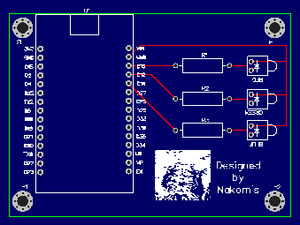

# led-flasher

## Architecture Diagram

Eventually this will all be [CDK/ASK](https://aws.amazon.com/blogs/devops/deploying-alexa-skills-with-aws-cdk/) but for now I simply created
the skill and lambda function in their respective web consoles.

## PCB

## Demo

