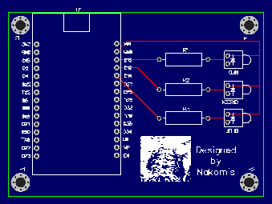

# led-flasher

Alexa skill that flashes LEDs connected to an ESP32 via AWS IoT, triggered by voice commands.

## Support

If you find this useful, please consider buying me a coffee:

## Architecture Diagram

Eventually this will all be [CDK/ASK](https://aws.amazon.com/blogs/devops/deploying-alexa-skills-with-aws-cdk/) but for now I simply created
the skill, lambda function, and IoT devices in their respective web consoles.

## PCB

## Demo

